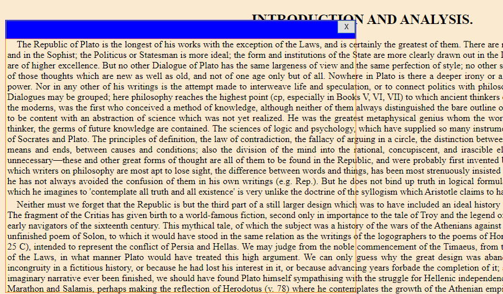

# Live OCR Window

Hover a transparent window over the part of the screen you want to capture at regular intervals, and have OCR results outputted to a text file.

## Preview

The OCR results are outputted to a textfile named **output.txt**.

## Getting Started (Windows x64)

1. Install [Vcpkg](https://github.com/Microsoft/vcpkg/blob/master/README.md#quick-start-windows).
   
2. Run `vcpkg.exe vcpkg install tesseract:x64-windows-static`.

3. Download the file [sciter.dll](https://github.com/c-smile/sciter-sdk/tree/master/bin.win/x64) and place it in this folder.  See the Sciter [license](https://github.com/c-smile/sciter-sdk/blob/master/license.htm).

4. Download the file [eng.traineddata](https://github.com/tesseract-ocr/tessdata) and place it in this folder.

5. Install the Rust toolchain.

6. Run `RUSTFLAGS=-Ctarget-feature=+crt-static cargo run`.

When done, click the `X` button to close the program and you may then view the results in `output.txt`.